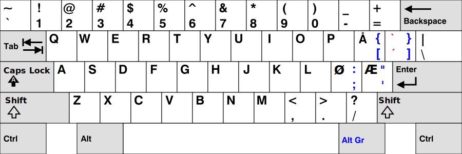

# The Norwerty Keyboard Layout



The Norwerty Keyboard Layout is a software keyboard layout for efficient typing in Norwegian on US keyboards.

I considered naming it NANSI, but settled on this name since it is based on the [Swerty keyboard layout](http://johanegustafsson.net/projects/swerty/) by Johan E. Gustafsson. See also [Dwerty](https://github.com/steveowashere/dwerty).

* [Norwerty for Windows](#norwerty-for-windows)
* [Norwerty for Linux](#norwerty-for-linux)
* Norwerty for macOS (coming soon)

The design goal for the Norwerty layout is to retain as much as possible of the standard US layout (also known as the ANSI keyboard layout), while adding the keys <kbd>Æ</kbd>, <kbd>Ø</kbd>, and <kbd>Å</kbd> from the standard Norwegian layout. This alternative software layout is especially useful if you are working on a US keyboard and want to write in Norwegian. Arguably, Norwerty is a better choice than the standard Norwegian layout even if you are working on a Norwegian keyboard, as it incorporates more of the superior key arrangement of the US layout. With the standard Norwegian layout, many frequently used symbols are surprisingly inconvenient to type, such as <kbd>@</kbd> in email addresses, <kbd>/</kbd> in web addresses, and <kbd>$</kbd> in programming. These conventions were set by people who used the US layout where these symbols can be typed conveniently. The Norwerty layout makes it possible to enjoy this convenience while typing in Norwegian.

The idea is to retain most of the US layout, but to have the keys <kbd>Æ</kbd>, <kbd>Ø</kbd>, and <kbd>Å</kbd> in their same positions as in the standard Norwegian layout, replacing the <kbd>;</kbd>, <kbd>'</kbd>, and <kbd>[</kbd> keys in the US layout. The <kbd>]</kbd> key is replaced by a dead key for acute and grave accents. The replaced keys from the US layout are reached by pressing <kbd>AltGr</kbd> and the original key. This basic layout has been altered somewhat in order to suit Mac, Linux, and Windows environments.

## Norwerty for Windows


### Installation instructions

1. [Download Norwerty for Windows](https://github.com/tobiasvl/norwerty/releases/latest) (under "Assets")

2. Unzip the zip file and run `setup.exe` to install the keyboard layout.

If you need to modify Norwerty for Windows, you can do so by editing [`Norwerty.klc`](https://raw.githubusercontent.com/tobiasvl/norwerty/master/windows/Norwerty.klc) with [Microsoft Keyboard Layout Creator](https://www.microsoft.com/en-us/download/details.aspx?id=22339).

## Norwerty for Linux


### Installation instructions

1. Add the contents of [`no.txt`](https://github.com/tobiasvl/norwerty/blob/master/linux/no.txt) to the end of the file `/usr/share/X11/xkb/symbols/no`

2. Look up the following section in the file `/usr/share/X11/xkb/rules/evdev.xml`:

```
    <layout>
      <configItem>
        <name>no</name>

        <shortDescription>no</shortDescription>
        <description>Norwegian</description>
        <languageList>
          <iso639Id>nor</iso639Id>
          <iso639Id>nob</iso639Id>
          <iso639Id>nno</iso639Id>
        </languageList>
      </configItem>
      <variantList>
```

3. Add the following variant block after the line `<variantList>`:

```
        <variant>
          <configItem>
            <name>norwerty</name>
            <description>Norwerty</description>
          </configItem>
        </variant>
```

4. Finally, after the line `! variant` in the file `/usr/share/X11/xkb/rules/evdev.lst` add the following line:
```
  norwerty          no: Norwerty
```

Now Norwerty should show up as one of the alternative keyboard layouts for Norwegian.
