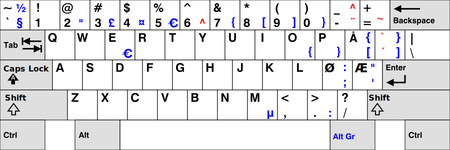

# Norwerty for Linux



## Installation instructions

1. Add the contents of [`no.txt`](https://github.com/tobiasvl/norwerty/blob/master/linux/no.txt) to the end of the file `/usr/share/X11/xkb/symbols/no`

2. Look up the following section in the file `/usr/share/X11/xkb/rules/evdev.xml`:

```
    <layout>
      <configItem>
        <name>no</name>

        <shortDescription>no</shortDescription>
        <description>Norwegian</description>
        <languageList>
          <iso639Id>nor</iso639Id>
          <iso639Id>nob</iso639Id>
          <iso639Id>nno</iso639Id>
        </languageList>
      </configItem>
      <variantList>
```

3. Add the following variant block after the line `<variantList>`:

```
        <variant>
          <configItem>
            <name>norwerty</name>
            <description>Norwerty</description>
          </configItem>
        </variant>
```

4. Finally, after the line `! variant` in the file `/usr/share/X11/xkb/rules/evdev.lst` add the following line:
```
  norwerty          no: Norwerty
```

Now Norwerty should show up as one of the alternative keyboard layouts for Norwegian.
