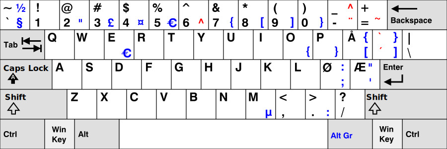

# Norwerty for Windows

## Installation instructions

1. [Download Norwerty for Windows](https://github.com/tobiasvl/norwerty/releases/latest) (under "Assets")

2. Unzip the zip file and run `setup.exe` to install the keyboard layout.

If you need to modify Norwerty for Windows, you can do so by editing [`Norwerty.klc`](https://github.com/tobiasvl/norwerty/blob/master/windows/Norwerty.klc) with [Microsoft Keyboard Layout Creator](https://www.microsoft.com/en-us/download/details.aspx?id=22339).
